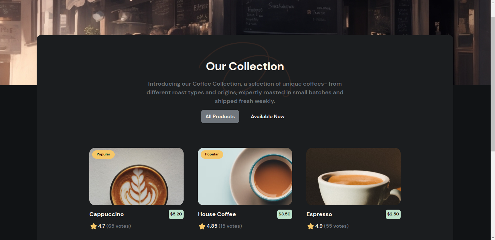

# Simple Coffee Listing App

This is a simple coffee listing app built with React for a challenge from [devchallenges.io](https://devchallenges.io/challenge/simple-coffee-listing). The app displays a list of coffees that can be filtered by availability status.

It aims to provide a simple and intuitive interface for browsing a collection of coffee products. By implementing reusable components and conditional rendering, it showcases the flexibility and power of React for building interactive user interfaces.

## Preview



## Features

- Coffee listing page that matches the given design.
- Reusable Card component.
- Card component includes a picture, name, pricing, rating, and number of votes if available.
- Conditional rendering of popular tag and availability status on the card component.
- Coffee list rendered from given data fetched from a JSON file.
- Users can choose to list all products or just available products.

## Technologies Used

- [React](https://react.dev/)
- [TypeScript](https://www.typescriptlang.org/)
- [Tailwind CSS](https://tailwindcss.com/)

## Setup

To run this project locally, follow these steps:

1. Clone the repository:

   ```bash
   https://github.com/akinyiliz/simple-coffee-listing.git
   ```

2. Navigate to the project directory:

   ```bash
   cd simple-coffee-listing
   ```

3. Install the dependencies:

   ```bash
   yarn install
   ```

4. Start the development server:

   ```bash
   yarn run dev
   ```

The app will be available at [http://localhost:5173](http://localhost:5173).

## Project Structure

```plaintext
src/
├── assets/                 # images and icons
├── components/             # Reusable components
|   └── CoffeeCard.tsx
|   └── Main.tsx
│   └── Products.tsx
├── types/                  # TypeScript type definitions
│   └── Coffee.ts
├── App.tsx                 # Main App component
└── main.tsx                # Entry point for the React application
```

## Contributing

Your contributions are highly welcome!

If you find any mistakes, have additional insights, or want to contribute, feel free to create a pull request or issues.

## Acknowledgements

- [devchallenges.io](https://devchallenges.io) for providing the challenge.
